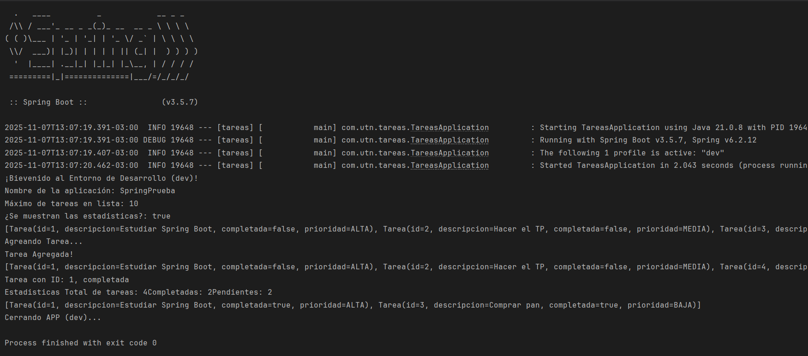

📝 Sistema de Gestión de Tareas (TP Fundamentos de Spring Boot)

Autor: Mariano López
Legajo: 48974

📝 Descripción del proyecto

Este proyecto es una aplicación de consola desarrollada con Spring Boot como parte del Trabajo Práctico de la materia Desarrollo de Software. El objetivo es construir un sistema básico de gestión de tareas (To-Do list) aplicando los conceptos fundamentales del framework Spring, demostrando el uso de:

Inyección de Dependencias (DI) por constructor.

Estereotipos de Spring (@Service, @Repository) para definir la arquitectura.

Configuración Externa usando archivos .properties.

Perfiles (Profiles) para gestionar diferentes configuraciones de entorno (dev y prod).

Beans Condicionales (@Profile) para cargar componentes según el entorno.

La aplicación corre como un script de CommandLineRunner que prueba la lógica de negocio al arrancar.

⚙️ Tecnologías utilizadas

Java 21+

Spring Boot 3.x

Maven (Gestor de dependencias)

Lombok (Para reducir el código "boilerplate" en los modelos)

🚀 Instrucciones para clonar y ejecutar el proyecto

Clona este repositorio en tu máquina local:

git clone https://github.com/marianolopez315/FundamentosSpringBoot.git

Abre el proyecto (pom.xml) en tu IDE de preferencia (ej. IntelliJ IDEA, VSCode con el pack de Java).

Espera a que Maven descargue todas las dependencias.

El proyecto está configurado para ejecutarse con el perfil dev por defecto.

Navega a la clase com.utn.tareas.TareasApplication y ejecuta el método main().

Observarás la salida del script de prueba en la consola.

🔧 Cómo cambiar entre profiles (dev/prod)

El perfil de la aplicación se controla desde el archivo src/main/resources/application.properties.

Perfil de Desarrollo (dev)

Este es el perfil por defecto. Carga la configuración desde application-dev.properties.

Configuración (application.properties):

spring.profiles.active=dev

Propiedades cargadas:

app.max-tareas=10

app.mostrar-estadisticas=true

logging.level.com.utn.tareas=DEBUG

Perfil de Producción (prod)

Para ejecutar en modo producción, cambia la línea en application.properties:

Configuración (application.properties):

spring.profiles.active=prod

Propiedades cargadas:

app.max-tareas=1000

app.mostrar-estadisticas=false

logging.level.com.utn.tareas=ERROR

📸 Capturas de Pantalla de la Consola

Ejecución con Perfil 'dev'

Ejecución con Perfil 'prod'

💭 Conclusiones Personales

La realización de este Trabajo Práctico fue fundamental para consolidar los conceptos teóricos de Spring Boot y aplicarlos en un proyecto funcional.

Inyección de Dependencias y Estereotipos: Se pudo implementar una arquitectura limpia separada por capas (@Repository, @Service). El uso de la inyección por constructor resultó ser una práctica central para lograr un código desacoplado, mantenible y fácil de testear.

Configuración y Perfiles: La gestión de la configuración externa mediante archivos .properties y la anotación @Value permitió externalizar valores clave (como app.max-tareas), haciendo la aplicación más flexible.

Beans Condicionales (@Profile): La implementación de perfiles (dev y prod) para cargar beans condicionales (MensajeDevService vs. MensajeProdService) fue una de las características más potentes, demostrando cómo una aplicación puede adaptar su comportamiento al entorno en el que se ejecuta sin cambiar el código.

